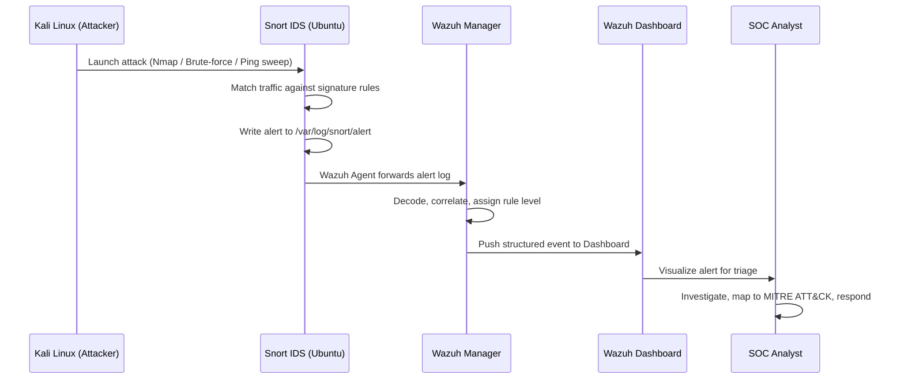

<div align="center">

# 🛡️ Wazuh + Snort Integration
### Centralized Threat Detection & SOC Monitoring Lab

[](https://wazuh.com/)
[](https://www.snort.org/)
[](https://www.kali.org/)
[](https://ubuntu.com/)
[](https://www.virtualbox.org/)

[]()
[]()
[]()

**A hands-on SOC lab integrating Snort IDS with Wazuh SIEM for real-time network threat detection, alert correlation, and security monitoring.**

[Overview](#-overview) •
[Architecture](#-lab-architecture) •
[Setup](#-installation-steps) •
[Attack Simulation](#-attack-simulation) •
[Detections](#-sample-detection-scenarios) •
[Screenshots](#-screenshots) •
[Roadmap](#-future-improvements)

</div>

---

## 📌 Overview

This project demonstrates the **integration of Snort IDS with Wazuh SIEM** to build a centralized threat detection and monitoring platform — simulating a real-world **Security Operations Center (SOC)** environment.

Network-based attacks launched from a Kali Linux machine are detected by **Snort**, forwarded to **Wazuh**, and visualized on a single dashboard where alerts can be correlated, triaged, and investigated — just like in an enterprise SOC.

> 💡 **Why this matters:** Most organizations don't rely on a single security tool. They layer an IDS/IPS (like Snort) at the network level with a SIEM (like Wazuh) for centralized visibility. This project replicates that exact layered defense model in a safe, isolated lab.

---

## 🎯 Project Objectives

| # | Objective |
|---|-----------|
| 1 | Deploy **Snort** as a Network Intrusion Detection System (NIDS) |
| 2 | Configure **Wazuh** for centralized log collection and analysis |
| 3 | Integrate **Snort alerts** into the Wazuh pipeline |
| 4 | Simulate real attacks using **Kali Linux** |
| 5 | Monitor & investigate alerts via the **Wazuh Dashboard** |
| 6 | Understand **SOC workflows** and the incident detection lifecycle |

---

## 🏗️ Lab Architecture

<div align="center">

```text
                    ┌──────────────────────┐
                    │      Kali Linux       │
                    │   🎯 Attacker Machine  │
                    │  Nmap • Brute-Force    │
                    │  Ping Sweeps • Recon   │
                    └───────────┬───────────┘
                                │
                          Attack Traffic
                                │
                                ▼
                    ┌──────────────────────┐
                    │    Ubuntu Server      │
                    │  🔍 Snort IDS Sensor  │
                    │  🔧 Wazuh Agent       │
                    │  Network Monitoring   │
                    └───────────┬───────────┘
                                │
                           Alert Logs
                                │
                                ▼
                    ┌──────────────────────┐
                    │    Wazuh Server       │
                    │  📊 SIEM Platform     │
                    │  Manager • Indexer    │
                    │  Dashboard            │
                    └──────────────────────┘
```

</div>

### 🔄 Data, Alert & Log Flow

```
Kali Linux (Attack) → Network Packets → Snort (Detection Engine)
        → Snort Rule Match → Alert Written to /var/log/snort/alert
        → Wazuh Agent (Log Collector) → Wazuh Manager (Analysis Engine)
        → Rule Correlation & Decoding → Wazuh Indexer (Storage)
        → Wazuh Dashboard (Visualization) → SOC Analyst (Investigation)
```

| Stage | Component | Function |
|-------|-----------|----------|
| **Generation** | Kali Linux | Generates attack/recon traffic |
| **Detection** | Snort (Ubuntu) | Inspects packets against signature rules |
| **Logging** | Snort | Writes matched events to alert log |
| **Collection** | Wazuh Agent | Tails Snort logs, forwards to Manager |
| **Correlation** | Wazuh Manager | Decodes, classifies, and rates severity |
| **Storage** | Wazuh Indexer | Stores structured alert data |
| **Visualization** | Wazuh Dashboard | Displays alerts, trends, and timelines |
| **Investigation** | SOC Analyst | Triages, maps to MITRE ATT&CK, responds |

---

## 🧰 Technologies Used

| Technology | Role | Category |
|------------|------|----------|
| 🛡️ **Wazuh** | SIEM & Security Monitoring | Detection & Response |
| 🚨 **Snort** | Network Intrusion Detection (NIDS) | Detection Engine |
| 💀 **Kali Linux** | Attack Simulation Platform | Offensive Testing |
| 🐧 **Ubuntu Server** | Snort Sensor Host | Operating System |
| 📦 **VirtualBox** | Virtualization Platform | Lab Infrastructure |
| 🐍 **Linux** | Core OS environment | Infrastructure |

---

## 🖥️ Environment Setup

<table>
<tr>
<th>🛡️ Machine 1 — Wazuh Server</th>
<th>🐧 Machine 2 — Ubuntu Server</th>
<th>💀 Machine 3 — Kali Linux</th>
</tr>
<tr>
<td valign="top">

- Wazuh Manager
- Wazuh Indexer
- Wazuh Dashboard
- Alert Correlation
- Log Storage

</td>
<td valign="top">

- Snort IDS Installation
- Network Traffic Monitoring
- Wazuh Agent Installation
- Alert Forwarding

</td>
<td valign="top">

- Attack Simulation
- Port Scanning
- Vulnerability Testing
- Traffic Generation

</td>
</tr>
</table>

---

## ⚙️ Installation Steps

### Step 1 — Install Ubuntu Server
- Download the Ubuntu Server ISO
- Create a new VM in VirtualBox
- Configure the network adapter (Internal/Host-Only network recommended for the lab)
- Complete the Ubuntu installation

### Step 2 — Install Wazuh (OVA Deployment)
- Download the official **Wazuh OVA**
- Import the OVA into VirtualBox
- Power on the Wazuh Server VM
- Access the **Wazuh Dashboard** via browser at `https://<wazuh-server-ip>`

### Step 3 — Install Snort on Ubuntu
```bash
sudo apt update
sudo apt install snort -y
```
Verify the installation:
```bash
snort -V
```

> 🧠 **Why:** Snort needs to be installed on the machine that sits in the path of network traffic — this is what gives it visibility into packets to inspect.

### Step 4 — Install the Wazuh Agent on Ubuntu
```bash
curl -s https://packages.wazuh.com/4.x/wazuh-install.sh | sudo bash
```
Then register the agent with the Wazuh Manager so it appears as an active endpoint on the dashboard.

> 🧠 **Why:** The agent is the bridge — without it, Snort's alerts stay local and never reach the SIEM for correlation.

### Step 5 — Configure Snort Alert Monitoring
Snort writes detection events here:
```bash
/var/log/snort/alert
```
Configure the Wazuh Agent to monitor this log path so every Snort alert is shipped to the Wazuh Manager in real time.

---

## ⚔️ Attack Simulation

All commands below are run **from Kali Linux** against the Ubuntu Server (Snort sensor) for authorized testing within the isolated lab network.

| Attack Type | Command | Purpose |
|-------------|---------|---------|
| **SYN Scan** | `nmap -sS <target-ip>` | Stealth port scan / reconnaissance |
| **Ping Sweep** | `nmap -sn <network-range>` | Host discovery across subnet |
| **Full Port Scan** | `nmap -p- <target-ip>` | Identify all open ports (1–65535) |

Each of these actions generates network traffic patterns that **Snort's rule engine** flags as suspicious — triggering alerts that flow straight into Wazuh.

---

## 🔁 Alert Flow



1. **Kali Linux** launches the attack
2. **Snort** detects the malicious activity against its rule set
3. **Snort** writes the alert to its log file
4. **Wazuh Agent** collects the log in near real-time
5. **Wazuh Manager** processes, decodes, and correlates the alert
6. **Wazuh Dashboard** visualizes the event
7. **SOC Analyst** investigates and responds

---

## 🕵️ Sample Detection Scenarios

### 🔎 Port Scanning Detection
| Field | Detail |
|-------|--------|
| **Source** | Kali Linux |
| **Target** | Ubuntu Server |
| **Detection** | Snort rule triggered on scan signature |
| **Visibility** | Wazuh Dashboard → Security Events |

### 🌊 ICMP Flood Detection
| Field | Detail |
|-------|--------|
| **Trigger** | Excessive ICMP traffic volume |
| **Detection** | Snort threshold/flood rule |
| **Outcome** | Logged and analyzed via Wazuh |

### 🛰️ Reconnaissance Activity
| Field | Detail |
|-------|--------|
| **Trigger** | Network/host scanning behavior |
| **Forwarding** | Alert sent to SIEM |
| **Response** | Investigation performed through Dashboard |

---

## 📋 SOC Analysis Template

Use this format when documenting any alert investigated during the project:

| Field | Example |
|-------|---------|
| **Alert Name** | NMAP TCP SYN Scan Detected |
| **Severity** | Medium |
| **Source IP** | `192.168.56.105` (Kali Linux) |
| **Destination IP** | `192.168.56.110` (Ubuntu Server) |
| **MITRE ATT&CK Mapping** | `T1046` – Network Service Discovery |
| **Impact** | Reconnaissance precursor to potential exploitation |
| **Recommended Action** | Monitor source IP, validate firewall rules, escalate if scan precedes exploit attempts |

---

## 🧩 SOC Use Case

This project replicates a real-world SOC architecture where:

- 🚨 **Snort** acts as the Network IDS sensor at the perimeter/host level
- 🛡️ **Wazuh** acts as the central SIEM platform for correlation and visibility
- 📊 Security events are **collected, normalized, and correlated** in one place
- 🕵️ Analysts investigate incidents from a **single pane of glass** — the dashboard

This mirrors how enterprises monitor network threats and respond to suspicious activity at scale, just using lighter-weight, open-source tooling.

---

## 📸 Screenshots

> Replace these placeholders with your actual lab screenshots before publishing.

| Wazuh Dashboard | Snort Alerts | Lab Topology |
|---|---|---|
| `screenshots/wazuh-dashboard.png` | `screenshots/snort-alerts.png` | `screenshots/lab-architecture.png` |

---

## 🧠 Skills Demonstrated

<div align="center">

`Security Monitoring` `SIEM Administration` `Network Intrusion Detection` `Threat Detection`
`Log Analysis` `Incident Investigation` `Linux Administration` `SOC Operations` `Security Event Correlation`

</div>

---

## 🚀 Future Improvements

- [ ] Integrate **Suricata IDS** as an alternative/complementary engine
- [ ] Add **Sigma Rules** for detection-as-code
- [ ] Implement **Active Response** (automated blocking via Wazuh)
- [ ] Deploy a full **ELK Stack** comparison pipeline
- [ ] Integrate **Threat Intelligence Feeds** (e.g., AbuseIPDB, MISP)
- [ ] Create **Custom Snort Detection Rules** for project-specific scenarios

---

## 👤 Author

**Amjad Khaleel Farhan**
*Aspiring SOC Analyst | Cybersecurity Student*

[](https://github.com/amjadkfp)

---

## 📄 License

This project is intended **for educational and cybersecurity research purposes only**. All attack simulations were performed in an **isolated virtual lab environment** against systems owned by the author. Do not use these techniques against systems you do not own or have explicit written authorization to test.

---

<div align="center">

⭐ **If you found this project useful, consider giving it a star!** ⭐

</div>
