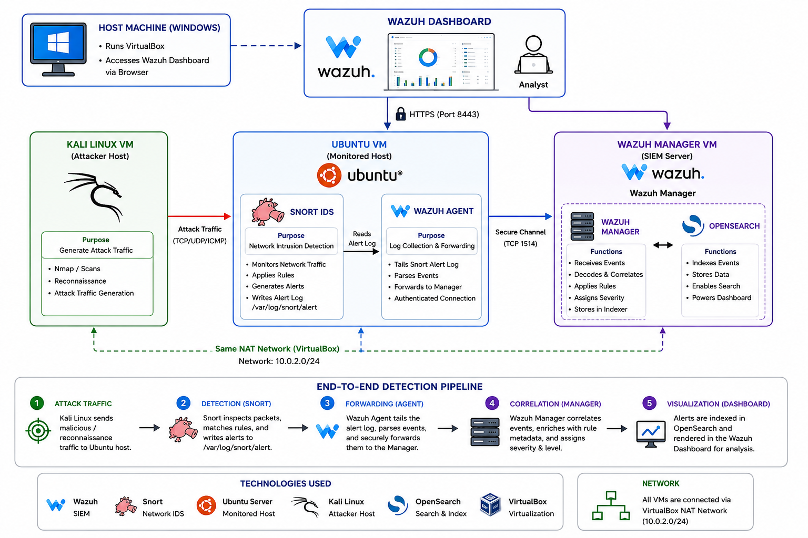

<div align="center">

# 🛡️ Wazuh + Snort Integration
### Centralized Intrusion Detection and Monitoring

*A hands-on SOC lab project integrating **Snort** (open-source network IDS) with **Wazuh** (open-source SIEM) to build a centralized threat detection and monitoring pipeline, entirely in a self-hosted virtual lab.*

---


</div>

---

## 🗺️ Architecture Diagram

<p align="center">
  
</p>

---

## 📋 Overview

This project builds a working pipeline where:

| Step | Component | Action |
|:----:|-----------|--------|
| 1️⃣ | **Snort** | Inspects live network traffic at the packet level and writes a structured alert when a rule matches |
| 2️⃣ | **Wazuh Agent** | Tails Snort's alert log in real time and forwards parsed events |
| 3️⃣ | **Wazuh Manager** | Correlates incoming events and assigns severity / rule metadata |
| 4️⃣ | **Wazuh Dashboard** | Renders the alert for analyst review — searchable, filterable, attributable |

```
Attack traffic → Snort (detection) → Wazuh Agent (forwarding)
→ Wazuh Manager (correlation) → Wazuh Dashboard (visualization)
```

---

## 🖥️ Lab Architecture

| Machine | Role | IP Address | Key Software |
|---------|------|:----------:|--------------|
| 🔵 Wazuh-Manager | SIEM Server | `10.0.2.12` | Wazuh Manager, Dashboard, OpenSearch |
| 🟠 Ubuntu-Victim | Monitored Endpoint | `10.0.2.14` | Snort IDS, Wazuh Agent |
| 🟢 Kali Linux | Planned Attacker Host | `N/A` | Nmap, pentest toolkit |

All VMs were orchestrated in Oracle VirtualBox on a shared NAT Network (`10.0.2.0/24`).

> **⚠️ Note:** Due to host RAM constraints (8 GB), the Kali Linux VM could not run concurrently with the other two machines for the final test. Attack traffic was instead generated from the Wazuh-Manager VM against the victim, preserving the same cross-host network architecture. See the [troubleshooting log](#-troubleshooting-highlights) below for the full reasoning.

---

## ✅ Result

A live TCP SYN scan launched against the victim host was:

- ✅ Detected by Snort, classified as an **SNMP information-leak attempt** (Priority 2)
- ✅ Forwarded through the Wazuh Agent
- ✅ Correlated by the Wazuh Manager (**Rule ID 20100**, severity level **8**)
- ✅ Rendered as a fully attributed event in the Wazuh Dashboard

> 📁 See `screenshots/` for the full evidence trail, and `docs/Wazuh_Snort_Integration_Report.docx` for the complete write-up.

---

## 🚨 SOC-Style Alert Analysis

<div align="center">

| 🔍 Field | 📄 Detail |
|----------|-----------|
| **Alert Name** | SNMP AgentX/tcp request / SNMP request tcp |
| **Severity** | 🟡 Medium — Wazuh rule level **8** · Snort Priority **2** |
| **Source IP** | `10.0.2.12` |
| **Destination IP** | `10.0.2.14` |
| **MITRE ATT&CK** | `T1046` – Network Service Discovery · `T1040` – Network Sniffing |
| **Impact** | Reconnaissance probing for an exposed SNMP service |
| **Recommended Action** | Disable SNMP if unused · Restrict via firewall · Enforce SNMPv3 |

</div>

---

## 🔧 Troubleshooting Highlights

This project hit (and resolved) several genuine real-world issues — documented in full in the report, summarized here:

<details>
<summary><b>1. 🔑 GPG Keyring Syntax Error</b></summary>

> A single-character typo (`gunpg-ring` vs `gnupg-ring`) caused opaque import failures. Resolved by separating key download from import.

</details>

<details>
<summary><b>2. 🌐 VirtualBox NAT Network Isolation</b></summary>

> The host machine couldn't reach the dashboard directly. Resolved via VirtualBox port forwarding (`127.0.0.1:8443` → `10.0.2.12:443`).

</details>

<details>
<summary><b>3. 👁️ Self-Scan Traffic Invisible to Snort</b></summary>

> Traffic a host sends to its own IP routes through the loopback interface (`lo`), never touching the network adapter Snort monitors. Confirmed via `ip route get`, resolved by generating attack traffic from a genuinely separate host.

</details>

<details>
<summary><b>4. 💥 OpenSearch (Wazuh Indexer) OOM-Kill</b></summary>

> The indexer crashed under host memory pressure, breaking dashboard login. Diagnosed via `systemctl status wazuh-indexer` showing `Result: oom-kill`.

</details>

<details>
<summary><b>5. 🔄 Agent Re-Enrollment Conflict</b></summary>

> A VM reboot caused the agent to register under a new ID, resolved by treating the manager's agent list as the source of truth.

</details>

<details>
<summary><b>6. 🗂️ Malformed <code>ossec.conf</code> XML</b></summary>

> A new `<localfile>` block was added outside any `<ossec_config>` wrapper. Fixed by wrapping it correctly.

</details>

---

## 📁 Repository Structure

```
.
├── 📄 README.md
├── 📂 docs/
│   └── Wazuh_Snort_Integration_Report.docx   # Full project report
├── 📂 config/
│   ├── ossec.conf.snippet                    # Redacted localfile config (no keys/secrets)
│   └── snort.conf.snippet                    # Redacted sfportscan config
├── 📂 screenshots/                           # Evidence trail, Fig. 1–10
└── 📂 diagrams/
    └── architecture_diagram.png
```

> ⚠️ Configuration files in `config/` are **redacted snippets** for demonstration only. Real deployment files (`client.keys`, full `ossec.conf`) containing authentication secrets are intentionally excluded — see `.gitignore`.

---

## 🛠️ Tools & Technologies

<div align="center">


</div>

---

## 📜 License

> This project is for educational purposes as part of a SOC / cybersecurity coursework lab.

---

<div align="center">

*Built with 🔐 for learning — by a future SOC analyst.*

</div>
